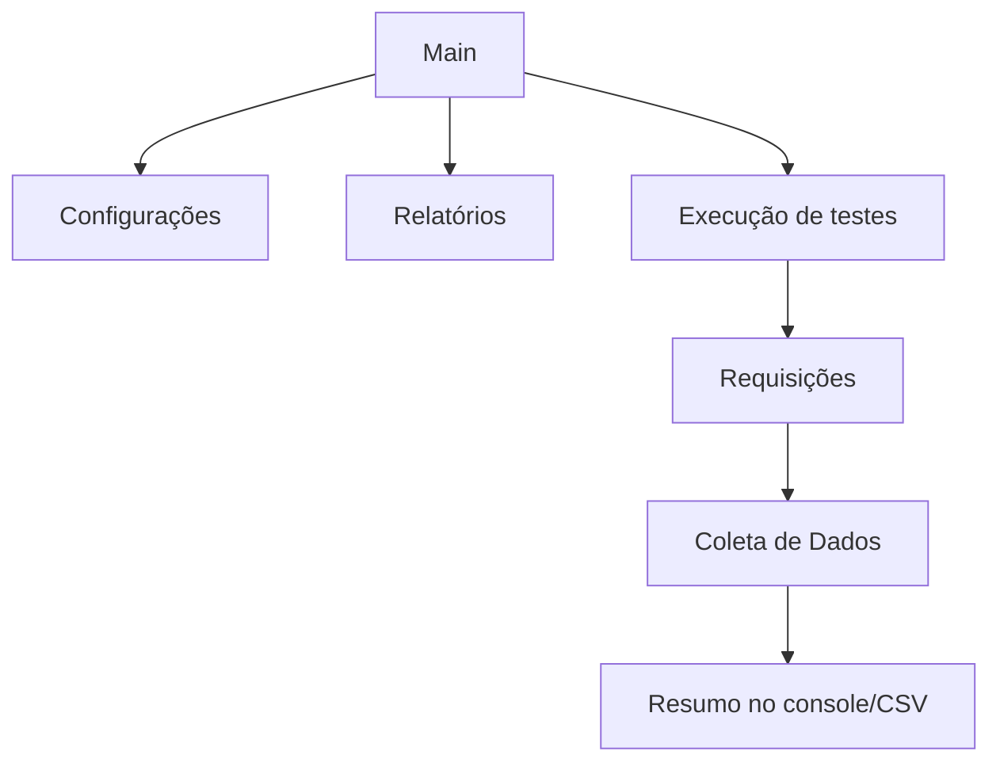

# Teste de Carga API || DOS

Este projeto é um script de estudo para realizar testes de carga em múltiplos endpoints de API. Ele utiliza programação assíncrona para enviar requisições HTTP de forma concorrente, logar as respostas e gerar um relatório de desempenho. O objetivo é testar um API que criei.

## Resumo

Este script realiza testes de carga em APIs, enviando um número configurado de requisições simultâneas e registrando o tempo de resposta e status de cada requisição. Os dados coletados são armazenados e processados para gerar um relatório detalhado, incluindo um CSV e um resumo no console.

## Conceitos Aplicados

- **Concorência e Paralelismo:** Utiliza o asyncio para gerênciar mútiplas requisições HTTP assíncronas;
- **Relatórios:** Coleta dados sobre os testes, gerando um CSV e um resumo na tela;
- **Estruturas de Dados com Pandas**;

## UML



## Estrutura do projeto:

```bash
.
├── config.py          # Arquivo de configuração
├── main.py            # Script principal
├── report.py          # Classe para geração de relatórios
├── utils.py           # Funções utilitárias
├── requirements.txt   # Dependências do projeto
└── README.md          # Documentação do projeto
```

## Perguntas aprendidas:

1. **O que é a concorrência em programação e como ela pode ser alcançada em Python?**  
   Concorrência é a capacidade de executar múltiplas tarefas ao mesmo tempo, melhorando a eficiência. Em Python, isso pode ser alcançado usando `asyncio` para operações assíncronas, `threading` para executar múltiplos threads e `multiprocessing` para processos paralelos.

2. **Qual é a importância de definir um número de requisições em testes de carga?**  
   Definir o número de requisições em testes de carga é crucial para simular condições reais de uso, identificar gargalos de desempenho e garantir que o sistema pode lidar com a carga esperada sem falhas.

3. **Como você pode gerenciar múltiplas requisições HTTP assíncronas em Python?**  
   Em Python, múltiplas requisições HTTP assíncronas podem ser gerenciadas usando a biblioteca `httpx` com `asyncio`. A função `asyncio.gather` é utilizada para executar múltiplas corrotinas simultaneamente, permitindo a manipulação eficiente de requisições.

4. **O que é um endpoint de API e como ele é usado?**  
   Um endpoint de API é uma URL específica onde um serviço pode ser acessado para realizar operações específicas. Ele é usado para interagir com recursos da web, enviando e recebendo dados conforme os métodos HTTP definidos (GET, POST, etc.).

5. **Por que é importante definir um limite de tentativas de requisições em casos de falha?**  
   Definir um limite de tentativas ajuda a evitar loops infinitos de requisições falhadas, melhorando a resiliência do sistema. Isso garante que, após um número específico de falhas, a aplicação possa tomar ações alternativas ou alertar sobre problemas.

6. **Como você poderia medir o tempo de resposta de uma requisição HTTP?**  
   O tempo de resposta de uma requisição HTTP pode ser medido registrando o tempo antes e depois da requisição e calculando a diferença. Bibliotecas como `httpx` fornecem métodos para obter o tempo de resposta diretamente.

7. **O que é um relatório de teste de carga e quais informações ele deve conter?**  
   Um relatório de teste de carga documenta o desempenho de um sistema sob carga. Ele deve conter informações como o número total de requisições, tempo de resposta, taxas de sucesso/falha, e estatísticas de desempenho para identificar possíveis melhorias.

8. **Qual é a utilidade de gerar um arquivo CSV a partir dos dados de teste?**  
   Gerar um arquivo CSV permite armazenar e compartilhar dados de teste de forma estruturada e legível. CSVs são amplamente suportados por ferramentas de análise e podem ser usados para gerar gráficos, relatórios detalhados e análises de desempenho.

9. **Como você pode usar pandas para manipular e analisar dados?**  
   A biblioteca pandas oferece estruturas de dados como DataFrame, que facilitam a manipulação e análise de grandes conjuntos de dados. Com pandas, é possível filtrar, agrupar, calcular estatísticas e exportar dados para diversos formatos.

10. **O que são threads e como eles são usados para paralelizar tarefas em Python?**  
    Threads são unidades de execução que permitem rodar várias tarefas simultaneamente dentro de um processo. Em Python, a biblioteca `threading` permite criar e gerenciar threads, útil para tarefas de I/O e outras operações que podem ser paralelizadas.

11. **Qual é a função de um cliente HTTP assíncrono, como o `httpx.AsyncClient`?**  
    Um cliente HTTP assíncrono, como `httpx.AsyncClient`, permite realizar requisições HTTP de forma não bloqueante. Ele é útil para executar múltiplas requisições simultaneamente, melhorando a eficiência e desempenho em aplicações que requerem alta concorrência.

12. **Por que a manipulação de exceções é importante ao fazer requisições HTTP?**  
    Manipulação de exceções é crucial para lidar com erros inesperados, como falhas de rede ou respostas inválidas. Isso garante que o programa possa responder apropriadamente a problemas, evitando que ele trave e fornecendo feedback útil para resolução de problemas.

13. **Como você pode dividir a carga de requisições entre múltiplos threads?**  
    Dividir a carga de requisições entre múltiplos threads pode ser feito distribuindo as requisições de forma balanceada entre eles. Cada thread executa um subconjunto das requisições totais, permitindo que a carga seja processada de forma mais eficiente e rápida.

14. **O que significa "total_requests" em um teste de carga?**  
    "Total_requests" refere-se ao número total de requisições que serão enviadas durante um teste de carga. Este valor é utilizado para simular a carga de trabalho esperada e avaliar como o sistema lida com um grande volume de requisições simultâneas.

15. **Como você calcula o tempo médio de resposta das requisições em um teste de carga?**  
    O tempo médio de resposta é calculado somando todos os tempos de resposta das requisições e dividindo pelo número total de requisições. Isso fornece uma métrica de desempenho útil para avaliar a eficiência do sistema sob carga.

16. **Qual é a importância de logar o status das requisições HTTP?**  
    Logar o status das requisições HTTP é importante para monitorar o desempenho e identificar problemas. Registros detalhados permitem análise posterior, ajudando a diagnosticar falhas, medir sucesso e ajustar configurações para melhor desempenho.

17. **O que significa `asyncio.gather` e como ele é utilizado?**  
    `asyncio.gather` é uma função que executa múltiplas corrotinas de forma concorrente e retorna os resultados agregados. É utilizado para gerenciar várias tarefas assíncronas simultaneamente, permitindo melhor controle e eficiência no código assíncrono.

18. **Por que é útil ter um relatório que mostre requisições falhas?**  
    Um relatório que mostra requisições falhas é útil para identificar problemas específicos que afetam o desempenho do sistema. Ele ajuda a diagnosticar a causa das falhas, permitindo ajustes e melhorias para aumentar a confiabilidade e eficiência.

19. **Como a biblioteca `time` pode ser usada para medir a duração de um teste?**  
    A biblioteca `time` pode ser usada para medir a duração de um teste registrando o tempo antes e depois do teste e calculando a diferença. Isso fornece uma métrica simples e precisa do tempo total gasto para concluir o teste de carga.

20. **O que é um método `__init__` em uma classe Python?**  
    O método `__init__` é o construtor de uma classe em Python. Ele é executado automaticamente quando uma nova instância da classe é criada, inicializando atributos e configurando o estado inicial do objeto.

21. **Como você coleta e formata informações de tempo em Python?**  
    Informações de tempo podem ser coletadas usando a biblioteca `time` ou `datetime`. Elas oferecem funções para obter o tempo atual, medir intervalos e formatar timestamps em diferentes representações legíveis e estruturadas.

22. **Por que é importante armazenar dados de teste com timestamps?**  
    Armazenar dados de teste com timestamps é importante para rastrear quando cada requisição foi feita, facilitando a análise temporal do desempenho. Timestamps ajudam a correlacionar eventos e identificar padrões ou anomalias ao longo do tempo.

23. **O que é a biblioteca `dotenv` e como ela pode ser usada para gerenciar configurações?**  
    A biblioteca `dotenv` carrega variáveis de ambiente de um arquivo `.env` para o ambiente de execução. Isso permite separar configurações sensíveis e específicas do ambiente do código, melhorando a segurança e facilitando a gestão de diferentes ambientes.

24. **Como você poderia usar o método `append` para adicionar dados a uma lista em Python?**  
    O método `append` adiciona um novo item ao final de uma lista existente. Em Python, ele é utilizado para incrementar dinamicamente uma lista, como adicionar registros de log ou resultados de testes à medida que são coletados.

25. **O que são DataFrames em pandas e por que são úteis para análise de dados?**  
    DataFrames são estruturas de dados tabulares bidimensionais em pandas. Eles são úteis para análise de dados porque permitem manipular, filtrar e analisar grandes conjuntos de dados de forma eficiente, aplicando operações em linhas e colunas.

26. **Por que é importante gerar relatórios de desempenho após testes de carga?**  
    Gerar relatórios de desempenho após testes de carga é importante para avaliar como o sistema se comporta sob condições de uso intensivo. Isso ajuda a identificar gargalos, otimizar recursos e garantir que o sistema atenda aos requisitos de desempenho esperados.

27. **Qual é a função do método `join` em threads Python?**  
    O método `join` em threads Python é usado para esperar que um thread termine sua execução antes de continuar com o restante do programa. Ele sincroniza a execução, garantindo que threads sejam finalizadas e resultados sejam consolidados antes de prosseguir.

28. **Como você poderia calcular a média de uma lista de números em Python?**  
    A média de uma lista de números em Python pode ser calculada somando todos os números da lista e dividindo pelo número total de elementos. Isso é feito usando a função `sum` para somar e `len` para contar os elementos da lista.

29. **O que é um CSV e por que ele é usado para armazenar dados de relatórios?**  
    CSV (Comma-Separated Values) é um formato de arquivo simples usado para armazenar dados tabulares em texto plano, onde cada linha representa um registro e os valores são separados por vírgulas. É usado para exportar e compartilhar dados estruturados de forma legível e fácil de processar.

30. **Como você pode combinar dados de múltiplas fontes em um relatório unificado?**  
    Dados de múltiplas fontes podem ser combinados em um relatório unificado usando ferramentas como pandas. Com pandas, você pode ler diferentes conjuntos de dados, unir e mesclar DataFrames, e gerar relatórios consolidados em formatos como CSV ou Excel.
