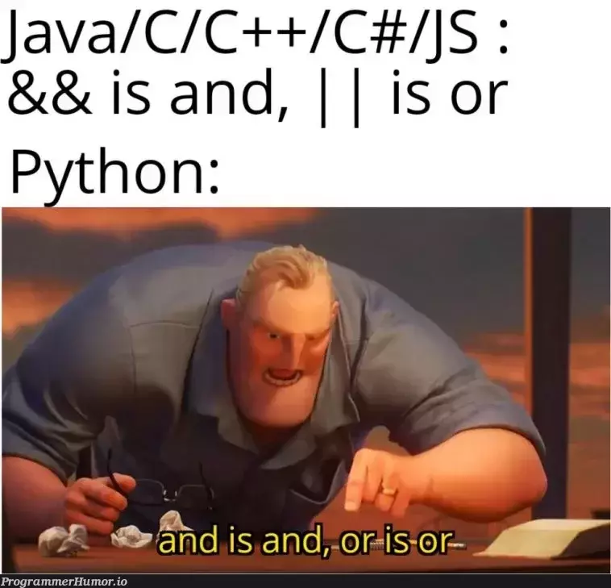
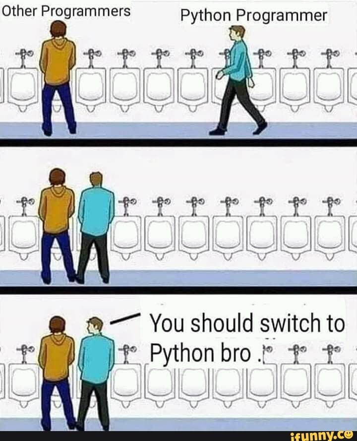

# Rota JavaScript

Comecei esses respositório com o objetivo de aprender JavaScript, e dado que não consigo fazer nada simples, decidi começar aprendendo como aplicar tecnologias com scripts no mundo real. Projetei esse diretorio baseado em como o JavaScript é aplicado, desenvolvendo scripts para o BackEnd e FrontEnd, Mobile e Desktop. O oibjetivo é treinar a sintaxe e boas práticas, além de aprender o que consigo fazer com ele, expremendo um computador ao máximo.

  

# Tecnologias estudas e usadas
## Bibliotecas e tecnologias  Backend

- Node.js;
- Express.js;
- Mongoose;
- MongoDB;
- JWT (JSON Web Token);
- bycrypt;

## Bibliotecas Frontend
- React Native
    - View;
    - Text;
    - StyleSheet;
    - Alert;
    - Share;
- React:
    - useState;
    - useEffect;
- React Native Localize:
- i18n-js;
- Reatct Native Community:
    - Geolocation;
    - Async Storage;
- React Native Chart Kit:
    - BarChart;

  

## Observação

E caso queira me contatar, pode acessar minha pagina inicial.

Sinta-se à vontade para explorar os exemplos de código fornecidos e experimentar com eles para praticar suas habilidades em React.

  

