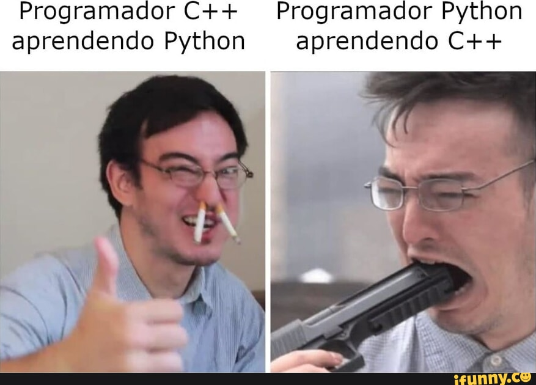

# Rota Python

Agora de fato decidi começar a codar em Python. Dado a versatilidade, planejo tentar aprender a espremer o máximo dessa linguagem. Inicialmente planejo fazer minha rota de sempre, pedindo para o ChatGPT me ensinar a logica, e quando pegar 5 estrelas, começo a recodar  e aplimorar scripts no GitHub. Minha meta é aprender automação, Machine Learning, Data Science e Pen Test.

  

# Tecnologias estudas e usadas
## Processamento de Texto:
- Teoria de Conjuntos
- TF-IDF

  

## Observação

E caso queira me contatar, pode acessar minha pagina inicial.

Sinta-se à vontade para explorar os exemplos de código fornecidos e experimentar com eles para praticar suas habilidades em React.

  

